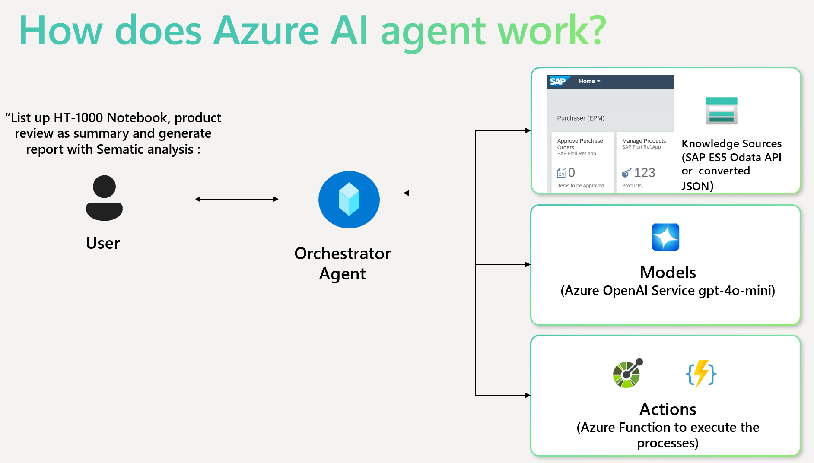
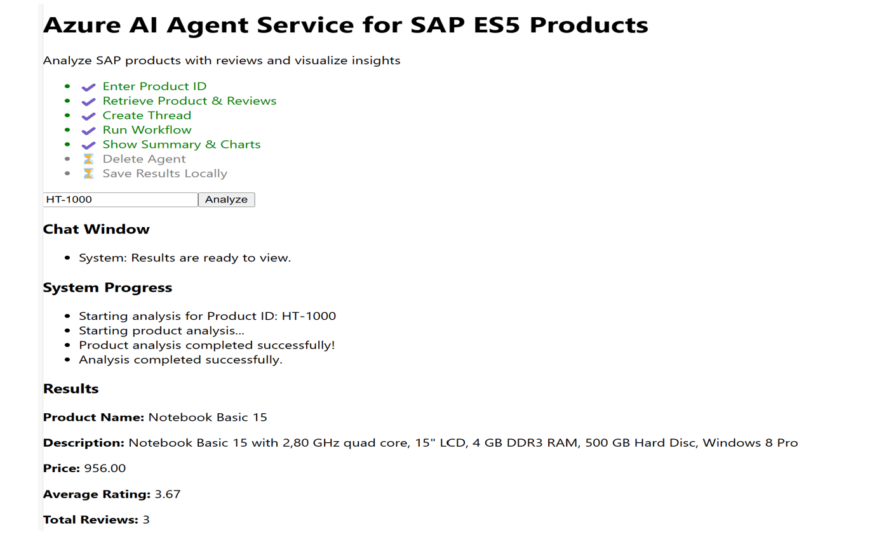

# Azure AI Agent Service Demo for SAP Products & Review

This repository showcases an **Azure AI Agent Service** that automates product insights and sentiment analysis for SAP products, such as `HT-1000`. The solution leverages **Azure AI Foundry SDK**, **Azure OpenAI**, and **Azure Functions** to streamline workflows for customer service managers.

## 🏗️ How the AI Agent Works

The demo enables users to **retrieve real-time product details, analyze customer reviews, and generate automated reports** using Azure AI Agent service workflows.



1. **User enters a Product ID** (e.g., `HT-1000`).
2. **Orchestrator Agent** (powered by Azure AI Agent Service) processes the request.
3. **Models (Azure OpenAI GPT-4o-mini)** perform semantic analysis and review summarization.
4. **Actions (Azure Functions)** execute backend logic to fetch data and generate reports.
5. **Data Sources:** Product data is retrieved from **SAP ES5 OData API** or pre-converted JSON files.

---

## ⚙️ Tech Stack & Components

This project is built using **Azure AI and SAP integration**, including:

- **Azure AI Foundry SDK** → Creates, manages, and orchestrates AI agents.
- **Azure Functions** → Hosts API endpoints for analysis and product retrieval.
- **Azure OpenAI (GPT-4o-mini)** → Performs NLP-based semantic analysis and summarization.
- **SAP OData API** → Fetches product details and customer reviews.
- **React Frontend** → Allows users to enter Product IDs and visualize results.
- **Python Backend** → Implements orchestration logic and integrates with Azure services.
- **Visualization Libraries** → Generates bar and pie charts for sentiment analysis.

---

## 🚀 Setup Instructions

### 1️⃣ Clone the Repository

```bash
git clone https://github.com/cjpark-sapcsa/azure-ai-agent-demo-sapes5.git
cd azure-ai-agent-demo-sapes5
```

### 2️⃣ Install Dependencies

#### Backend (Python)

If using **Visual Studio Code (VSC)**, create and activate a Python virtual environment before installing dependencies:

Navigate to the backend directory:

```bash
cd backend
```

Create a virtual environment:

```bash
python -m venv .venv
```

Activate the virtual environment:

- On **macOS/Linux**:

  ```bash
  source .venv/bin/activate
  ```

- On **Windows**:

  ```bash
  .venv\Scripts\activate
  ```

Install required dependencies:

```bash
pip install -r requirements.txt
```

#### Frontend (React)

Ensure that the `/src/components` directory and its required files are present before running the frontend application.

Navigate to the frontend directory:

```bash
cd frontend
```

Install dependencies:

```bash
npm install
```

---

### 3️⃣ Configure Environment Variables

#### Prerequisites

Make sure you have the necessary **access and permissions** to create models via **Azure AI Foundry**.
You can find your **Project Connection String** in the **Azure AI Foundry portal**, under **Project details > Project connection string**.

📖 Refer to the official **[Azure AI Agent Quickstart Guide](https://learn.microsoft.com/en-us/azure/ai-services/)** for more details.

#### Setting Up the Connection String

Create a `.env` file inside `backend/` and add:

```bash
PROJECT_CONNECTION_STRING="your-azure-ai-connection-string"
```

Ensure the `.env` file is excluded from Git by adding it to `.gitignore` to keep sensitive credentials secure.

---

### 4️⃣ Run the Services

#### Start the Azure Functions Backend

```bash
cd backend
func start
```

#### Start the React Frontend

```bash
cd frontend
npm start
```

---

## 🎯 Usage Instructions



Once the services are running:

1️⃣ Open **[http://localhost:3000](http://localhost:3000)** in your browser.

2️⃣ Enter a **Product ID** (e.g., `HT-1000`).

3️⃣ Click **Analyze** to trigger the AI workflow.

4️⃣ The AI Agent will:

- Retrieve **Product & Reviews** from SAP.
- Create a **Thread** to process the request.
- Run the **Workflow** using Azure AI services.
- Show **Summary & Charts** for product insights.

5️⃣ Results will be displayed in the UI, including:

- **Summarized reviews**.
- **Sentiment analysis** (positive/negative).
- **Generated charts** (bar & pie visualizations).

---

## 📌 How Azure AI Agent Works

This diagram shows the **Orchestrator Agent workflow**:

1. The **User** enters a **Product ID**.
2. The **Orchestrator Agent** coordinates:
   - **SAP OData API** to fetch product data and reviews *(for this demo, XML-based OData API has been converted into JSON)*.
   - **Azure OpenAI** for semantic analysis and summarization.
   - **Azure Functions** to execute the process.
3. The **final analysis results and visualizations** are shown in the UI.

---

## 📜 License

This project is licensed under the **MIT License**. See the **LICENSE** file for details.

